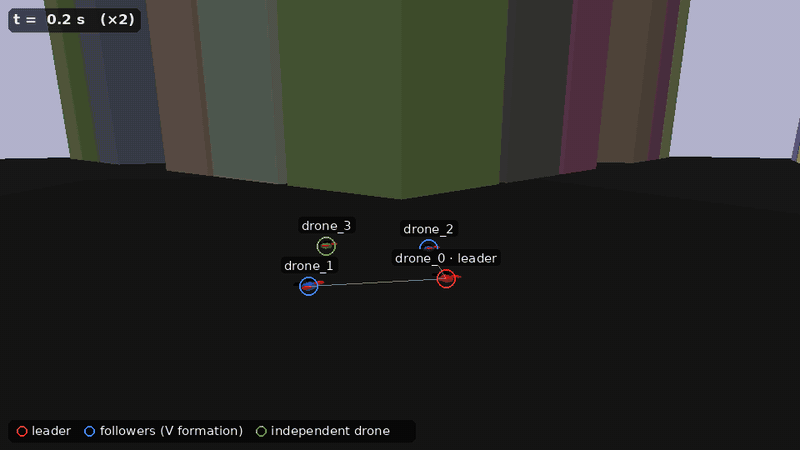
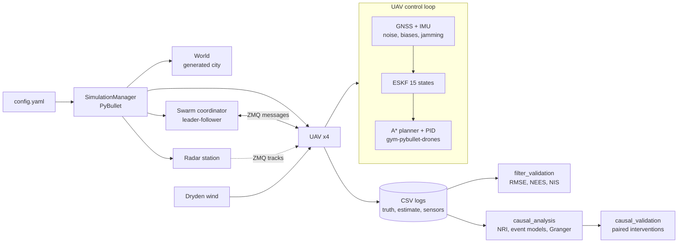
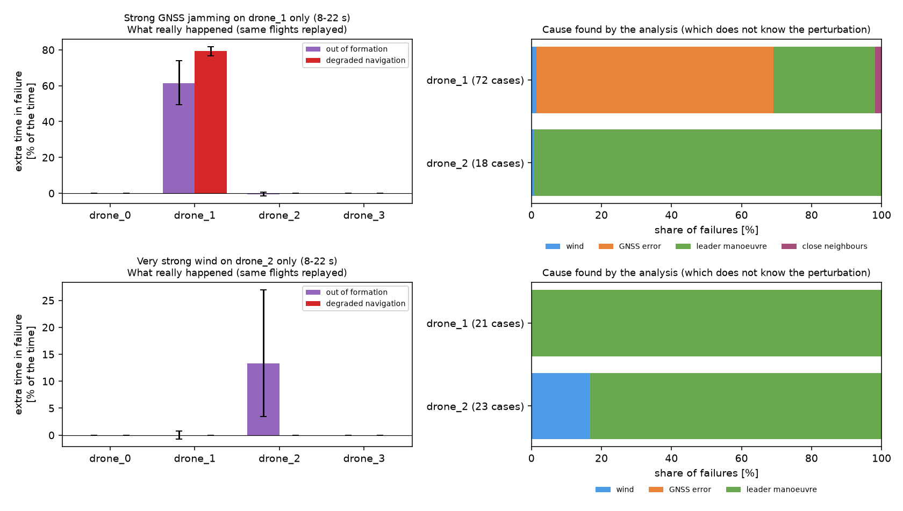

# Drone swarm simulator: GNSS/INS navigation and causal analysis of failures


A PyBullet simulator of a quadrotor swarm (leader–followers + an independent
drone) flying through a generated city, with GNSS/IMU sensor models
(**RTK-grade GNSS, σ = 10 cm**), a **15-state error-state Kalman filter**, and a
**causal analysis** that explains why drones fail, validated against controlled
interventions.

Started as a 5-month research internship at the **Autonomous and Intelligent
Systems Lab, KAIST** (Prof. Hyo-Sang Shin, 2025–2026), as a team of two
ISAE-Supméca students; extended afterwards (navigation filter, statistical
validation, causal verification). See [who did what](#who-did-what).

Published with the agreement of the KAIST AIS Lab, Prof. Hyo-Sang Shin and the
supervising professors at ISAE-Supméca.



*Default scenario, played at 2× speed: the leader (red) plans its route through the
streets, the two followers (blue) hold a V formation behind it, the independent
drone (green) climbs on its own. In the turns the V rotates with the leader's heading
and briefly deforms: these are the formation losses the causal analysis attributes to
the leader's manoeuvres. Rings, labels, trails and the white formation links are drawn
over the PyBullet render.*

## Architecture



## The simulator

- **World**: a city generated at start-up as a URDF, 4 × 4 blocks of 20 m separated
  by 10 m streets, 9 buildings per block, 30–50 m tall (`environment/world.py`).
- **Quadrotors**: Crazyflie-sized (27 g). Rotor thrust, torques and aerodynamic drag
  are applied in PyBullet at 240 Hz; the gym-pybullet-drones PID flies them at 80 Hz,
  with thrust and tilt limits, stricter near the ground (`entities/uav.py`).
- **Path planning**: buildings are rasterised into a heightmap (0.25 m cells, inflated
  by a 0.25 m safety margin); A* searches it at the lowest altitude of the leg
  without cutting corners, then the path is smoothed by line of sight. Planning runs
  in a background thread; repulsive forces keep drones away from walls, roofs and
  each other (`Control/Path_planning.py`, `entities/uav.py`).
- **Swarm**: leader–follower. The leader flies its waypoints; the followers hold
  V-formation slots in the leader's frame (1 m back and 1 m aside per rank). The
  formation turns with the leader's heading (at most 2 rad/s), and targets are
  pushed apart to keep 0.6 m between drones (`swarm/swarm.py`). drone_3 is outside
  the swarm and flies its own mission.
- **Sensors and navigation**: GNSS at 10 Hz with noise, jamming and outages; MEMS
  IMU with biases, scale factor and random walk; each drone navigates on its own
  filter estimate (`entities/sensor.py`, `Control/ESKF.py`).
- **Wind**: Dryden turbulence per drone, with optional bursts (`environment/wind.py`).
- **Logs**: one CSV per drone with truth, estimate, sensors, wind and interactions,
  the input of the analyses.

### Communication between agents

Agents only exchange information through [ZeroMQ](https://zeromq.org/)
publish/subscribe messages (`TOPIC {json}` over TCP), relayed by a proxy run by the
swarm coordinator. Each message is delivered with a simulated delay of about
100 ms, and receivers extrapolate positions by the age of the message.

| Message | From → to | Rate | Purpose |
|---|---|---|---|
| `State` | each swarm drone → coordinator | 10 Hz | estimated position, velocity and heading |
| `FUTURE_POS` | coordinator → followers | 50 Hz | each follower's formation target |
| `SWARM` | coordinator → drones | 50 Hz | neighbours' positions, for avoidance |
| `RADAR` | radar station → drones | 1 Hz | noisy tracks of drones within 30 m, including drones outside the swarm |

## Key results

| | |
|---|---|
| **Navigation filter** | ESKF consistent on 24 Monte-Carlo flights × 4 drones: NEES 5.8–6.1 (expected 6), NIS 5.95–6.03 (expected 6), position RMSE 3.8–4.0 cm with RTK-grade GNSS (σ = 10 cm), about 4.5× better than the raw fixes |
| **Accelerometer bias** | drone_2 has a 0.5 m/s² accelerometer offset: the ESKF estimates it and stays consistent, the 6-state baseline becomes 3× less accurate and over-confident (NEES 55.9 instead of 6) |
| **GNSS outage (10 s)** | with a BMI088-class MEMS IMU, the ESKF drifts 2.9 m (median) and stays inside its 3σ envelope; the 6-state filter, even given the true attitude, drifts 4.4 m and its 95th-percentile error reaches 1.7× its own envelope: it can be wrong without knowing it |
| **Causal analysis** | in replayed flights with one injected perturbation, the analysis blames the right drone and the right cause: GNSS jamming of drone_1 → GNSS blamed for 89 % of its navigation-loss onsets and 57 % of its formation-loss onsets; wind burst on drone_2 → wind cited for drone_2 only (17 % of its formation-loss onsets: wind mostly makes failures last longer); no false attribution in nominal flights. Percentages are indicative, not calibrated |

All results use RTK-grade GNSS (σ = 10 cm on position, 5 cm/s on velocity, see
`config.yaml`). A standard receiver is accurate to about a metre: the
centimetre-level RMSE follows from this setting and does not carry over to it.

### GNSS outage: drift and integrity


One recorded flight replayed 40 times with new sensor noise and biases, BMI088-class
IMU (`mems_nav`). Bottom panel (one run): the ESKF pins down the vertical
accelerometer bias within a few seconds; the horizontal ones stay uncertain on this
trajectory (wide ±3σ bands), so most of its advantage is on the vertical axis.
Middle panel: above 1, the error is outside the envelope the filter reports. Outside
the outage both filters sit at the values expected for a consistent filter (median
0.42, 95th percentile 0.80). With the much noisier IMU of `config.yaml`, the ESKF
drifts slightly more than the 6-state filter (6.6 vs 5.9 m) but stays consistent
([details](docs/navigation.md)).

### Does the causal analysis find the right cause?



Same flights replayed with one perturbation. Left: what really happened, as the
extra share of the 8–22 s window spent in failure (percentage points, 95 % bootstrap
interval); formation loss only exists for the followers, so the leader and drone_3
have no real bar there. Right: what the analysis concludes from the logs **without
knowing** the perturbation, as the share of failure onsets given to each cause, all
failure types pooled (about two thirds GNSS for drone_1: 89 % of its navigation
losses, 57 % of its formation losses); drones without failure onsets are not listed.

Details, limits and reliability assessment:
[docs/navigation.md](docs/navigation.md) · [docs/causal_analysis.md](docs/causal_analysis.md)

## Who did what

**Adrian Ujkaj, during the internship**:
- the whole causal analysis module: log alignment, failure detection, NRI
  (PyTorch), logistic root-cause attribution, Granger tests
  (`analysis/causal_analysis.py`), and its first ablation experiments (since
  replaced by the interventional validation);
- the synchronised CSV logging that feeds the analysis (`entities/uav.py`) and the
  log plotting tool: trajectory, GNSS and filter position errors
  (`analysis/plot_uav_log.py`);
- the first swarm coordinator: leader–follower formation, each follower's target
  computed from offsets in the leader's frame (`swarm/swarm.py`), later extended
  with messaging;
- the first quadrotor model and its control: URDF, rotor thrust, cascaded
  position/attitude PID with anti-windup, used until the switch to
  gym-pybullet-drones;
- the YAML scenario loading and the entry point (`utilities/config.py`, `main.py`).

**Adrian Ujkaj, after the internship** (2026):
- 15-state error-state Kalman filter and IMU modelled as increments
  (`Control/ESKF.py`, `entities/sensor.py`);
- statistical filter validation (Monte-Carlo NEES/NIS) and GNSS outage study
  (`analysis/filter_validation.py`, `analysis/nav_replay.py`, `analysis/gnss_outage.py`);
- causal analysis redesign (physical failure thresholds, separation of causes and
  mediators, NRI checked on unseen flights) and its interventional validation
  (`analysis/causal_validation.py`, `analysis/run_causal_study.py`);
- simulator fixes found while closing the loop and validating it: wind model, drag
  frame, control rate, thrust limits, formation layout; test suite.

**Lucas Morvan** (internship partner): procedural city
and heightmap-based A* planner, original Dryden wind model, swarm messaging and
radar station, quadrotor dynamics (`environment/`, `Control/Path_planning.py`,
`swarm/`, `entities/static_sensor.py`).

**Together, during the internship**: GNSS/IMU sensor models (GNSS noise and
time-windowed jamming, IMU measuring specific force in the body frame), the first
6-state navigation filter and the simulator architecture (`entities/sensor.py`,
`simulator/simulator_manager.py`, `entities/uav.py`).
The commit history shows the individual contributions.

## Quick start

**Windows:** run `setup_windows.bat`. It installs Miniforge if needed, creates a
local environment in `.conda\` (PyBullet from conda-forge) and launches a
simulation. Helper scripts: `scripts\windows\lancer_tests.bat`,
`scripts\windows\etude_causale.bat`.

**Linux / macOS:**

```bash
python -m venv .venv && source .venv/bin/activate
pip install -r requirements.txt
pip install --no-deps https://github.com/utiasDSL/gym-pybullet-drones/archive/7ebad1ecabd28a7000add2d05f888aa2e837c2cc.zip
```

**Run:**

```bash
python main.py                                       # simulation with the PyBullet GUI
python -m pytest                                     # test suite (~1 min)
python analysis/filter_validation.py --runs 24       # navigation filter validation
python analysis/run_causal_study.py --runs 6         # causal study, quick version
```

Scenarios live in `config.yaml` (world, swarm, drones, sensors, wind). Any key can
be overridden per drone, e.g. strong jamming of drone_1:
`--agent-override '{"@drone_1": {"sensors": {"gnss": {"jam_start": 8, "jam_end": 22, "jam_multiplier": 100}}}}'`.

## Repository layout

```
main.py                  entry point: python main.py [config.yaml]
config.yaml              scenario: world, swarm, drones, sensors, wind
simulator/               SimulationManager: PyBullet setup and main loop
entities/                UAV (control, planning, logging), GNSS/IMU sensors, radar
Control/                 ESKF (15 states), 6-state linear Kalman filter (kf6), A* planner
swarm/                   leader-follower formation coordinator (ZMQ)
environment/             generated city, wind model
utilities/               quaternions, buffered CSV logging, config loading
analysis/                filter validation, GNSS outage, causal analysis and validation
tests/                   pytest suite (filters, sensors, simulation, causal tools)
docs/                    method, results and limits
scripts/windows/         double-click launchers (tests, causal study)
```

Code comments are in English; console messages and figure labels are in French.

## Limitations

- Swarm messages go through ZMQ in real time: two flights with the same seed are
  not bit-identical. The interventional validation accounts for it
  (difference-in-differences, exclusion of pairs that diverge beforehand).
- The swarm coordinator reads true positions (centralised design). By default the
  inner attitude loop flies on the true attitude and rates, and the initial heading
  comes from the scenario. GNSS latency is not modelled; no magnetometer (yaw drifts
  in hover).
- The causal analysis is validated on one swarm geometry and two perturbation
  types; its percentages are indicative, not calibrated
  ([details](docs/causal_analysis.md#how-reliable-is-it)).
- Sensors are simulated with the very error model the ESKF assumes: the IMU comes
  from finite differences of the PyBullet velocity, projected with the filter's own
  mid-interval attitude (no coning, sculling or vibration; the scale-factor term is
  zero in every scenario), and GNSS noise is white, as large vertically as
  horizontally, with its exact σ passed to the filter. Filter consistency shows
  that the implementation is right, not how it would perform on real data.
- The perturbations of the causal validation are large (GNSS noise ×100,
  turbulence ×8), and the analysis relies on quantities only a simulator gives:
  true GNSS and navigation errors, wind at the drone.

## Acknowledgements

KAIST AIS Lab and Prof. Hyo-Sang Shin; ISAE-Supméca. Quadrotor model and PID
controller from [gym-pybullet-drones](https://github.com/utiasDSL/gym-pybullet-drones).
NRI: Kipf et al., *Neural Relational Inference for Interacting Systems*, ICML 2018.
ESKF: J. Solà, *Quaternion kinematics for the error-state Kalman filter*, 2017.
