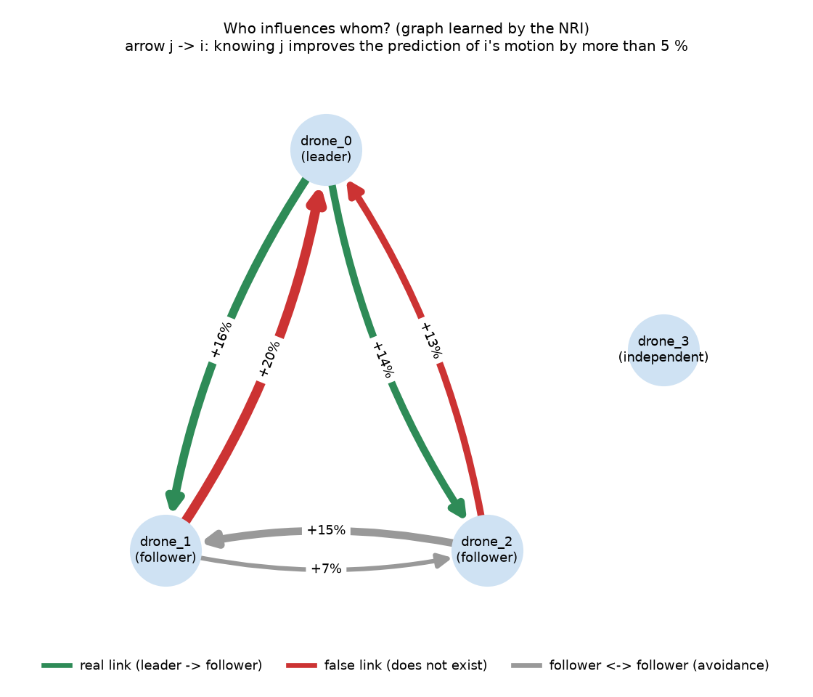

# Causal analysis of swarm failures

**Question:** when a drone of the swarm fails (leaves its formation slot, loses
navigation accuracy, comes too close to another drone), *what caused it*, and
*does the failure propagate to other drones*?

The analysis works on flight logs only (observational data). Its conclusions are
then **checked against controlled interventions**: the same flights are replayed
with a single perturbation, and the measured effect is compared with what the
analysis concluded without knowing the perturbation.

## Pipeline (`analysis/causal_analysis.py`)

1. **Failures** (what we explain), with physical thresholds identical for all drones,
   after take-off:
   - *loss of formation* (followers): distance to the slot, measured in the
     leader's frame, above 1 m for 0.5 s;
   - *navigation degradation*: filter position error above 0.3 m for 0.25 s;
   - *near miss*: distance to the nearest drone below 0.3 m.
2. **Candidate causes** (exogenous only): wind at the drone, GNSS error at
   measurement time, leader manoeuvre (for its followers), close neighbours
   weighted by the NRI graph. A variable that *defines* a failure, or a mediator
   (tracking error, formation error), is never used as a cause.
3. **Who influences whom: NRI** (Kipf et al., 2018). An encoder infers a
   directed interaction graph from trajectory windows; a message-passing decoder
   must predict the next velocities from it. Edge type 0 sends no message, a KL
   term pulls the graph towards sparsity, messages only see relative quantities,
   and each node knows its own recent past. The importance of an edge is the
   increase of the prediction error **on unseen flights** when that edge's
   relative information is permuted.
4. **What triggers a failure: event models.** Per failure type, a logistic model
   predicts failure onsets from the recent values of the causes. Quality is
   measured on unseen flights (cross-validation by flight); odds ratios get 95 %
   bootstrap intervals over flights. Each onset is attributed to the causes in
   proportion to their positive contributions; if none contributes, it is
   reported as *unexplained*.
5. **Granger tests** on the continuous quantities behind each failure,
   Bonferroni-corrected.
6. **Propagation matrix**: does a failure of drone *i* make a new failure of
   drone *j* more likely in the next 2 s, compared with a circular-shift null?

## Verification protocol (`analysis/causal_validation.py`)

Three paired campaigns of 24 flights × 30 s share the same seeds (same wind
realisation, same plan). In the campaigns reported here the IMU noise was drawn
independently in each flight: the sensor seeds were not yet derived from the flight
seed (they are now). This widens the paired differences and adds to the divergence
before the intervention, but cannot create a spurious effect.

| Campaign | Change |
|---|---|
| `base` | nominal configuration |
| `gnss_fort` | GNSS of **drone_1 only** jammed ×100 between 8 and 22 s |
| `vent_fort` | turbulence ×8 on **drone_2 only** between 8 and 22 s (same gust realisation, amplified) |

For each drone, the causal effect is the per-flight difference *intervened −
base* during the window, averaged with a bootstrap CI over seeds. The swarm talks
over ZMQ in real time, so two flights with the same seed already differ by
0.1–0.3 m before any intervention: the trajectory effect is computed as a
difference-in-differences (during − before), and pairs that diverge by more than
1 m before the intervention (another route around a building) are excluded:
8 of 24 pairs for GNSS, 7 of 24 for wind.

## Results


Left: extra share of the window spent in failure, in percentage points (pp), with
95 % bootstrap intervals; formation loss only exists for the followers. Right: share
of failure onsets given to each cause, all failure types pooled; drones without
failure onsets are not listed.

| Scenario | What really happened (during the window) | What the analysis concludes |
|---|---|---|
| Strong GNSS jamming, drone_1 (16 valid pairs) | drone_1: +80 pp of the time with degraded navigation [77 ; 82], +61 pp out of formation [50 ; 74], trajectory moved by 3.1 m; drone_2 moved by 7 cm (formation spacing rule); leader and independent drone unaffected | drone_1: GNSS error = 89 % of its navigation-loss onsets (odds ratio 2.0 per SD [1.95 ; 2.34], AUROC 0.99 on unseen flights) and 57 % of its formation losses; drone_2: 99 % leader manoeuvre |
| Very strong wind, drone_2 (17 valid pairs) | drone_2: +13 pp of the time out of formation [3 ; 27], trajectory moved by 0.7 m; other drones unaffected | wind cited for drone_2 only: 17 % of its formation-loss onsets (odds ratio 1.38 per SD [1.15 ; 1.68]); drone_1: 0 % wind |

**Negative controls.** In nominal flights no failure is attributed to wind or
GNSS (≈ 100 % to the leader's turns; odds ratios of wind and GNSS not significant).
Under GNSS jamming, drone_2 is not blamed on GNSS; under strong wind, drone_1 is
not blamed on wind.

**NRI graph (nominal flights).** Its edge probabilities rank the real leader →
follower links above the absent ones (AUROC 1.0 against the known structure, a weak
test with only two true links) and it gives no link to the independent drone; with
the graph, the prediction error on unseen flights is 31 % lower than without any
link. The permutation importance drawn below, however, finds false follower →
leader links as strong as the real ones: the followers' motion carries the leader's
*planned* heading, which the logs do not contain (a hidden common cause, so these
links are predictive, not causal).



## How reliable is it?

| Component | Verdict | Evidence |
|---|---|---|
| Which drone fails, and from which cause (event models + attribution) | **Reliable** in the tested scenarios | right drone and right cause in both interventions; negative controls clean |
| Attribution percentages | **Indicative only** | the shares describe what *triggers* failure onsets, not how long failures last: strong wind mainly makes drone_2's failures last longer (+13 pp of the time, 22 → 23 onsets), while its onsets still happen in the leader's turns, so wind gets 17 % |
| NRI graph | **Partially reliable** | finds leader → followers and the independent drone; keeps false follower → leader links (the swarm orients the formation with the leader's *planned* heading, which the logs do not contain); useless when a drone is strongly perturbed (then flagged on the figure) |
| Granger tests | **Weak here** | misses GNSS → navigation error under jamming (probably because the filter reacts within one test step of 0.2 s, while Granger only sees lagged effects); kept as a secondary check |
| Propagation matrix | **Weak signal** | consistent with the measured effects, but few significant cells |
| Scope of the test | **Limited** | large perturbations (GNSS noise ×100, i.e. σ = 10 m; turbulence ×8, gusts σ ≈ 8 m/s); the two perturbed quantities are among the candidate causes; failures and causes use quantities only a simulator gives (true GNSS and navigation errors, wind at the drone) |

The validation covers one swarm geometry and two perturbation types, in
simulation. It shows that the method gives the right qualitative answer when the
truth is known; it does not yet show that the percentages are calibrated.

## Next steps

- Dose-response test: vary the jamming or wind intensity; the attributed share
  should grow monotonically.
- Counterfactual attribution (risk with the cause set to its nominal value) to
  get calibrated percentages.
- Log the leader's planned heading, which would remove the false follower →
  leader links of the NRI.
- More interventions (perturbing the leader, combined causes) and other formations.
- Inject a cause outside the candidate list (a motor fault, say) and check that its
  failures come out as *unexplained* instead of being blamed on a listed cause.
- Replace simulator-only quantities with what a real drone logs (receiver accuracy,
  NIS, estimated wind).

## Reading the figures

- **Matrix orientation:** NRI matrices are *receiver i (row) × sender j (column)*;
  propagation matrices are *trigger (row) × affected drone (column)*.
- `graphe_interactions.png`: arrow j → i = knowing j improves the prediction of
  i's motion by more than 5 %; green = real link, red = false link, grey =
  follower ↔ follower (they only interact to avoid each other).
- `causes_defaillances.png`: per drone, share of its failure onsets attributed to
  each cause.
- `resume_etude.png` (validation): left, what really happened; right, what the
  analysis concluded.
- `--all_figures` adds, in `details/`: NRI heat maps (probabilities, permutation
  importance), training curves, odds ratios, Granger and propagation heat maps.

## Reproduce

```bash
python analysis/run_causal_study.py            # 3 campaigns + analyses + validation (1 to 3 h)
python analysis/run_causal_study.py --runs 6   # quick check
python analysis/causal_analysis.py --log_dir runs/mc --output_dir out --all_figures
```

The three figures to look at are copied to `runs/causal/RESULTATS/`.
